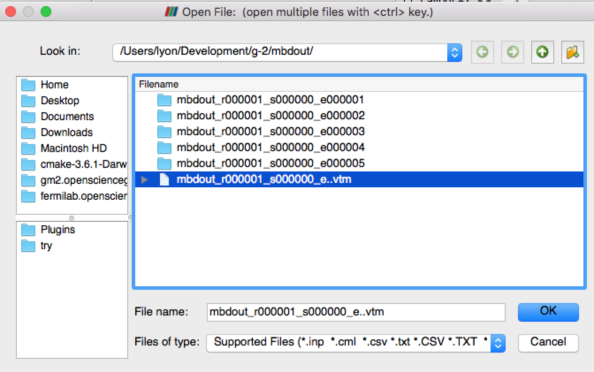

# artvtk
VTK and ParaView Catalyst interface with art.

The main repository is on GitHub at https://github.com/lyon-fnal/artvtk . 
It is also mirrored at Fermilab Redmine https://cdcvs.fnal.gov/redmine/projects/artvtk .

## Trying it out the examples

Here is how to try out the examples in the `g-2` 
environment using the Redmine mirror. This library will only work with 
 gm2 v7.

Log into a machine with `/cvmfs/gm2.opensciencegrid.org` and do...

```bash
# Setup the g-2 environment
source /cvmfs/gm2.opensciencegrid.org/prod7/g-2/setup
setup gm2 v7_01_00 -q prof
```

Create a development area and set it up

```bash
# Prepare the development area
cd <somewhere that is empty>
mrb newDev
source local*/setup
```

Checkout the `artvtk` code

```bash
# Get the git repository
cd srcs
mrb g artvtk
```

Build it

```bash
# Setup the build environment
source mrb s

# Build it!
mrb b
```

Let's run the non-Catalyst Live examples. 

```bash
# Go back to the top of the development area 
# (we're probably there already, but just in case..)
cd $MRB_TOP

# Make a directory for running
mkdir try ; cd try
```

All of the example FCL files run the `Cone` and `Sphere` producers (found 
in the `artvtk/example` directory). `Sphere` generates sphere at a random
position with a random size. `Cone` generates up to 10 cones and random
 positions with random sizes. 

Run `sphereCone_show.fcl` . This FCL file runs the `ShowVtkVizObjectsInEvent` 
analyzer which merely prints out the `VtkVizData` objects found in the
event. 

```bash
gm2 -c sphereCone_show.fcl
```

Run `sphereCone_toFile.fcl` . This FCL writes the VTK objects in the 
 event to a multiblockdata XML file set, one file set per event. A file set
 consists of a `.vtm` file and a corresponding directory containing the 
 consituent `.vtp` files. 
 
 ```bash
 gm2 -c sphereCone_toFile.fcl
 ```

Start up ParaView and open the set of VTM files. 



