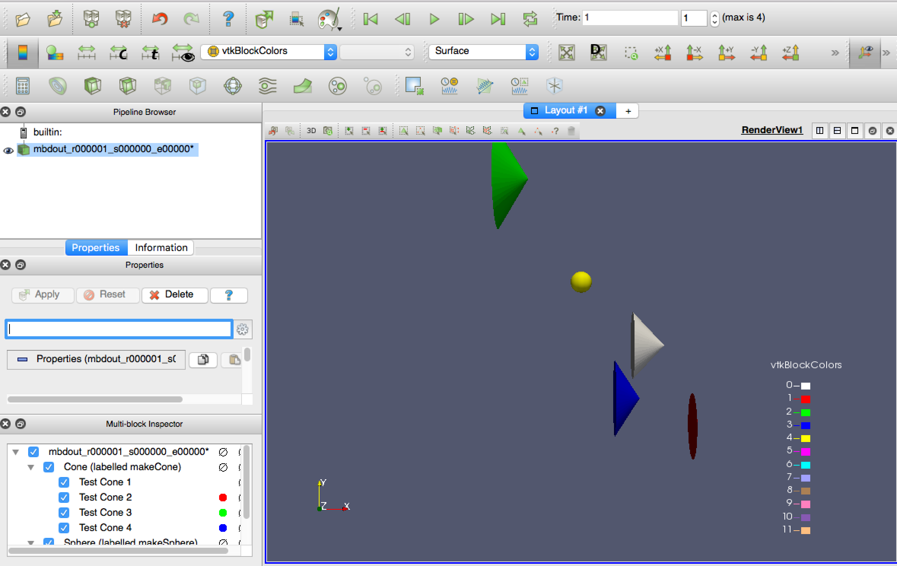

# artvtk
VTK and ParaView Catalyst interface with art.

The main repository is on GitHub at https://github.com/lyon-fnal/artvtk . 
It is also mirrored at Fermilab Redmine https://cdcvs.fnal.gov/redmine/projects/artvtk .

## Trying it out the examples

Here is how to try out the examples in the `g-2` 
environment using the Redmine mirror. This library will only work with 
 gm2 v7.

Log into a machine with `/cvmfs/gm2.opensciencegrid.org` and do...

```bash
# Setup the g-2 environment
source /cvmfs/gm2.opensciencegrid.org/prod7/g-2/setup
setup gm2 v7_01_00 -q prof
```

Create a development area and set it up

```bash
# Prepare the development area
cd <somewhere that is empty>
mrb newDev
source local*/setup
```

Checkout the `artvtk` code

```bash
# Get the git repository
cd srcs
mrb g artvtk
```

Build it

```bash
# Setup the build environment
source mrb s

# Build it!
mrb b
```

Let's run the non-Catalyst Live examples. 

```bash
# Go back to the top of the development area 
# (we're probably there already, but just in case..)
cd $MRB_TOP

# Make a directory for running
mkdir try ; cd try
```

All of the example FCL files run the `Cone` and `Sphere` producers (found 
in the `artvtk/example` directory). `Sphere` generates sphere at a random
position with a random size. `Cone` generates up to 10 cones and random
 positions with random sizes. 

**Run `sphereCone_show.fcl` .** This FCL file runs the `ShowVtkVizObjectsInEvent` 
analyzer which merely prints out the `VtkVizData` objects found in the
event. 

```bash
gm2 -c sphereCone_show.fcl
```

**Run `sphereCone_toFile.fcl` .** This FCL writes the VTK objects in the 
 event to a multiblockdata XML file set, one file set per event. A file set
 consists of a `.vtm` file and a corresponding directory containing the 
 consituent `.vtp` files. 
 
 ```bash
 gm2 -c sphereCone_toFile.fcl
 ```

Start up ParaView and open the set of VTM files as per the image below.
Do not click on the directories. Note that ParaView has grouped the 
`vtm` files (as seen by the expansion triangle on the left - click on that
to expand the list and see the individual `vtm` files) because they 
are in numerical sequence. Double click on that group (as shown).

Click on `Apply` in the `Properties` window. You can now use the "VCR"
buttons to see the events like a slide show.


Let's now run the Catalyst live examples. For these, you must have 
ParaView up and running and connected to CataLyst. 

To do that, start ParaView and go to the `Catalyst` menu and select `Connect`. 
Accept the default port. On a Mac, you may get a dialog box asking to allow for
outside connections. If you are running `art` on a different machine, then
click on `Allow`, otherwise click on `Deny`. Accept the confirmation box
that will appear. 

Now you want to put Catalyst in pause mode so that
you can see the first event. Go go the `Catalyst` menu and select 
`Pause Simulation`.

On the machine that is running `art`, if that machine is not the same
as where ParaView is running, you will then need to alter the 
python pipeline file. Run the command below, changing `<YOUR MACHINE>` 
to the name or IP address of the machine running ParaView.  

```bash
# Only do this if you are running ParaView on a different machine than
# art (including VMs and docker containers)
cp $MRB_BUILDDIR/artvtk/pipelines/catalystLiveMBDS_pipeline.py  .
sed -i 's/localhost/<YOUR MACHINE>/' catalystLiveMBDS_pipeline.py
# For example
# sed -i 's/localhost/192.168.50.1/' catalystLiveMBDS_pipeline.py
```

Now, run `art` with
```bash
gm2 -c sphereCone_live.fcl`
```

Art should stop on the first event. ParaView may open a dialog window 
warning that the `ProxyManger` is not set. Click on "Close" as that
warning seems to be benign. 

Now in the Pipeline Browser window under `catalyst:`, click on the greyed icons next to `evnetinfo`
and `vizes`. You should then see `Extract: eventinfo` and `Extract: vizes`
appear under `builtin`. Click on the greyed eye icon next to `Extract: vizes`. 
A new render window may appear. You may close the old one. You are now 
 looking at the first event. 


You can advance to subsequent event by going to the `Catalyst` menu
and selecting `Set Breakpoint`. Use `Time` for the event number. Note
that for some reason, ParaView will stop at the event after the one 
you specify. Go to the `Catalyst` menu and select `Continue` to go 
to that event. 

If you quit ParaView, `art` will continue making `VTK` objects and
trying to connect to a ParaView client. If you use the 
`sphereCone_live_ifConnected.fcl` FCL file, then VTK objects will not be
created if no ParaView client is connected. 


